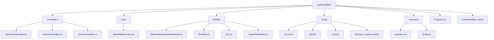

# 🚗DriveEase-Car Rental Website🚗


## 📘Overview
DriveEase is a complete car rental website built using the ASP.NET Core MVC framework. It provides a clean, modern interface for two types of users: Users (customers) who can browse and book vehicles, and Admins who can manage the vehicle fleet and customer bookings.

## 💻Tech Stack
This project is built with a modern .NET and web stack:

🧠Backend: ASP.NET Core MVC (.NET 8 / .NET 6+)

🧰Language: C#

🎨Frontend: HTML5, CSS3, JavaScript (ES6+)

## ⚙️Steps To Run:
### ✅Prerequisites

1. .NET SDK (Version 6.0 or newer)

2. A code editor like Visual Studio or VS Code

### ▶️Running the Project

1. Clone the repository (or download and unzip the project files).

2. Open a terminal or command prompt in the project's root folder

3. Restore Dependencies:
```bash
dotnet restore
```

4. Run:
```bash
dotnet run
```
Open your browser and navigate to the local URL shown in the terminal (usually `http://localhost:5123` or `https://localhost:7123`).

## 📊Project Flowchart



## 👤About the Author

This Car Rental Website(DriveEase) is developed by [Divy Lathiya](https://github.com/DivyLathiya).

🎉Thank You for Visiting.🎉
